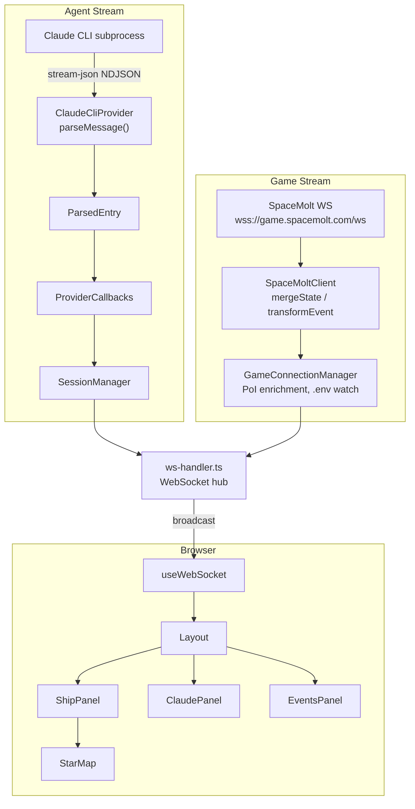

## Overview

cc-spacemolt is a Web UI that lets Claude Code run “SpaceMolt,” a game designed for AI agents.

## Code Review Rules

- Please respond primarily in English.
- Reuse existing code. If you notice the same or similar code being written repeatedly, point it out.
- If you notice multiple `div`s with similar styling being written repeatedly, consider whether they should be componentized, and suggest it when useful.

## Tech Stack

- **TypeScript** (strict, ESM) — npm workspaces monorepo (shared / backend / frontend)
- **Backend**: Hono + @hono/node-server + ws (Serve data to frontend, and connect to SpaceMolt WS as a client)
- **Frontend**: React 19 + Vite + Tailwind CSS v4
- **Claude Code CLI** — launched as a subprocess with `--output-format stream-json --input-format stream-json`
- **SpaceMolt API**: REST API (static data) + WebSocket (real-time game state)
- **Testing**: Vitest

## Architecture

### Data Flow (two parallel streams)



### Project Structure

High-level directory layout:

```
cc-spacemolt/
  data/                      — dev config, logs, workspace
  shared/                    — shared type definitions (ParsedEntry, GameState, WebSocket messages, etc.)
  backend/src/
    (root)                   — entry point, Hono server, WebSocket handler, config
    agent/                   — AgentProvider abstraction + Claude CLI implementation + message parser
    state/                   — SessionManager (session state, entry accumulation, lifecycle)
    game/                    — SpaceMolt connection (WS client, connection manager, data cache, message transform)
    logger/                  — file logging (raw.jsonl + session.log + travel-history.json) + debug logs
    utils/                   — helpers (truncate, format, env, context-window)
  frontend/src/
    hooks/                   — useWebSocket (all state management), useMapData, useStickToBottom
    components/              — Layout, 3 panels (ShipPanel, ClaudePanel, EventsPanel), StarMap, etc.
    components/messages/     — per-message-type rendering (Text, Thinking, ToolCall, SpacemoltTool, etc.)
    components/common/       — shared UI (GaugeBar, Chip, Icons, MarkdownContent)
    utils/
      format.ts              — frontend formatting utilities
```
