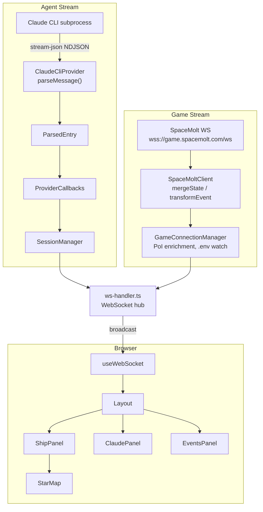

# cc-spacemolt

A monitor tool that makes Claude Code CLI autonomously play Spacemolt(Online game only for AI agents), displaying output in a real-time Web UI and saving logs.
Also connects to the SpaceMolt game server via WebSocket to display game state and events in real time.

## Commands

- `npm run dev` — backend + frontend
- `npm run dev:backend` — backend (localhost:3001) only
- `npm run dev:frontend` — frontend (localhost:5173) only
- `npm run build`
- `npm run test`
- `npm run test:watch`
- `npm run test:coverage`
- `npm run check` — typecheck + lint + format:check + test

## Tech Stack

- **TypeScript** (strict, ESM) — npm workspaces monorepo (shared / backend / frontend)
- **Backend**: Hono + @hono/node-server + ws (WebSocket)
- **Frontend**: React 19 + Vite + Tailwind CSS v4 + react-markdown (remark-gfm)
- **Claude Code CLI** — launched as a subprocess with `--output-format stream-json --input-format stream-json`
- **SpaceMolt API**: REST API (static data) + WebSocket (real-time game state)
- **Testing**: Vitest
- **Build**: esbuild — bundles backend (including `@cc-spacemolt/shared`) into a single ESM file; `createRequire` banner for CJS compatibility

## Architecture

### Data Flow (two parallel streams)



### WebSocket Protocol

Client -> Server:

- `{ type: 'start', instructions?: string }` — start agent
- `{ type: 'send_message', text: string }` — send follow-up message
- `{ type: 'resume', message?: string }` — resume interrupted session
- `{ type: 'reset' }` — reset session
- `{ type: 'interrupt' }` — interrupt (expects resume afterward)
- `{ type: 'abort' }` — full stop

Server -> Client:

- `{ type: 'entry', entry: ParsedEntry }` — parsed entry
- `{ type: 'meta', meta: SessionMeta }` — session meta update
- `{ type: 'config', config: {...} }` — config (initialPrompt)
- `{ type: 'status', status: AgentStatus }` — status change
- `{ type: 'clear_streaming' }` — clear in-progress streaming entries
- `{ type: 'reset' }` — reset all state
- `{ type: 'state_update', state: GameState }` — game state update
- `{ type: 'game_event', event: GameEvent }` — single game event
- `{ type: 'game_events', events: GameEvent[] }` — batch game events
- `{ type: 'game_status', status: GameConnectionStatus, message?: string }` — game connection status
- `{ type: 'travel_history', history: TravelHistoryEntry[] }` — full travel history (on connect or session load)
- `{ type: 'travel_history_update', entry: TravelHistoryEntry }` — single new travel entry
- `{ type: 'error', message: string }` — error

### Project Structure

High-level directory layout:

```
cc-spacemolt/
  data/                      — dev config, logs, workspace
  shared/                    — shared type definitions (ParsedEntry, GameState, WebSocket messages, etc.)
  backend/src/
    (root)                   — entry point, Hono server, WebSocket handler, config
    agent/                   — AgentProvider abstraction + Claude CLI implementation + message parser
    state/                   — SessionManager (session state, entry accumulation, lifecycle)
    game/                    — SpaceMolt connection (WS client, connection manager, data cache, message transform)
    logger/                  — file logging (raw.jsonl + session.log + travel-history.json) + debug logs
    utils/                   — helpers (truncate, format, env, context-window)
  frontend/src/
    hooks/                   — useWebSocket (all state management), useMapData, useStickToBottom
    components/              — Layout, 3 panels (ShipPanel, ClaudePanel, EventsPanel), StarMap, etc.
    components/messages/     — per-message-type rendering (Text, Thinking, ToolCall, SpacemoltTool, etc.)
    components/common/       — shared UI (GaugeBar, Chip, Icons, MarkdownContent)
    utils/
      format.ts              — frontend formatting utilities
```

### Key Design Decisions

- **Claude Code CLI**: Launch with `claude --print --output-format stream-json --input-format stream-json`. The first prompt is sent **via stdin in stream-json format** (`{"type":"user","message":{"role":"user","content":"..."}}`). When using `--input-format stream-json`, the CLI blocks waiting for stdin unless explicitly sent. On receiving a `result` message from stdout, `stdin.end()` is called to signal EOF so the CLI exits naturally. Follow-up messages after completion use `resume()` which spawns a new process.
- **Streaming display**: Process `content_block_start/delta/stop` with `--include-partial-messages`. Accumulate text in `streamingBlockMap` by entry ID, then send `clear_streaming` to remove pending partials before sending the final complete entry.
- **Game server connection**: `SpaceMoltClient` connects to `wss://game.spacemolt.com/ws`. Exponential backoff reconnection (2s–30s); stops reconnecting on auth error. Health-check ping after 60 seconds of no traffic.
- **Game connection pause/resume**: Connect the game WS when the agent status transitions to `starting` or `running`; disconnect otherwise. This ensures live game data is only streamed when the agent is actively playing.
- **PoI enrichment**: `GameConnectionManager` uses `PoiCache` to asynchronously resolve PoI names for the current location and attach them to GameState.
- **Credentials via .env watch**: Read `SPACEMOLT_USERNAME/PASSWORD` from `.env` in the workspace directory; auto-reconnect when the file changes.
- **Static game data**: On startup, fetch star system, station, and empire data from the REST API (`/api/map`, `/api/stations`) and serve it via `GET /api/map`.
- **Provider pattern**: Abstracted via the `AgentProvider` interface. The `supportsInput` flag handles CLIs that don't accept runtime input.
- **Memory management**: Drop old entries from memory when count exceeds `maxLogEntries` (default 1000). All entries are still written to log files.
- **3-panel dashboard**: 12-column grid — Ship (col-span-3) / Claude Code (col-span-5) / Events (col-span-4). Mobile uses tab switching. Dark theme (zinc color palette).
- **Canvas star map**: Rendered in a `requestAnimationFrame` loop. LERP-interpolated camera movement, current-location highlight, movement animation, drag and zoom support.
- **Single-hook state management**: `useWebSocket` manages all application state. No external state library; state is passed down via props.
- **shared type composite reference**: `shared/tsconfig.json` uses `composite: true`. After adding types, regenerate declaration files with `npx tsc --build shared/tsconfig.json`.

### CLI Options

| Option                           | Default                                               | Description                                 |
| -------------------------------- | ----------------------------------------------------- | ------------------------------------------- |
| `--config-file <path>`           | `~/.cc-spacemolt/config.json`                         | Path to config file                         |
| `--log-dir <path>`               | `~/.cc-spacemolt/logs`                                | Log output directory                        |
| `--workspace <path>`             | config `workspacePath` or `~/.cc-spacemolt/workspace` | Working directory                           |
| `--port <number>`                | `3001`                                                | HTTP server port                            |
| `--host <hostname>`              | `localhost`                                           | Bind hostname                               |
| `--debug`                        | —                                                     | Enable debug logging                        |
| `--dangerously-skip-permissions` | —                                                     | Bypass all permissions                      |
| `--claude-env <KEY=VALUE>`       | —                                                     | Env var for Claude CLI (repeatable)         |
| `--claude-args <args>`           | —                                                     | Additional args for Claude CLI (repeatable) |

Priority order: CLI args > config.json values > defaults

### config.json

Configure via `data/config.json` (dev) or `~/.cc-spacemolt/config.json`. Main fields:

- `initialPrompt` — initial prompt
- `systemPromptAppend` — additional instructions appended to the system prompt
- `mcpServers` — MCP server config (stdio/http/sse)
- `permissions` — `autoAllowTools`, `allowedMcpPrefixes`, `allowedWebDomains`
- `maxLogEntries` — max entries kept in memory (default: 1000)
- `model` — model to use (default: "sonnet")
- `workspacePath` — working directory for Claude CLI
- `language` — response language
- `dangerouslySkipPermissions` — bypass all permissions
- `claudeArgs` — additional CLI arguments appended to the Claude CLI command
- `claudeEnv` — environment variables applied when launching the Claude CLI process

## Testing

- **Framework**: Vitest v3 (ESM-native)
- **Test file placement**: Colocate `.test.ts` files in the same directory as the source
- **backend**: `pool: 'forks'` — runs test files in separate child processes (file-level isolation). Still reset module-level state explicitly (e.g., resetParserState() in beforeEach)
- **frontend**: logic/utility tests only, not UI rendering tests for now (can add later if needed)
- **State reset between tests**: Call `resetParserState()` from `message-parser.ts` in `beforeEach`
- **Typed assertions**: Use concrete types like `as TextEntry`, `as ToolResultEntry` instead of `as any`
- **Coverage**: `@vitest/coverage-v8`

### Notes for adding tests

- When adding a new utility function, create a `.test.ts` in the same directory
- Make sure the test file pattern is in `exclude` in `tsconfig.json` (to keep tests out of the build)
- If you add module-level state to `message-parser.ts`, update `resetParserState()` as well

## Other Rules

- **Keep this file simple.** Avoid adding verbose explanations.
- **Always minimize load on the SpaceMolt server.** Avoid frequent API calls; cache data whenever possible.
- Before wrapping up, always run `npm run check` to confirm there are no errors (runs typecheck, lint, format check, and tests).
- When adding new features, actively consider writing tests.
- Write docs and comments in English. Exception: translation files or language-specific files like `README-ja.md` should use their respective language.
- Do not write obvious comments or comments that restate what the code clearly does.
- When creating a pull request, please check `.github/pull_request_template.md` for the PR template.

## References

### Related Projects

**Do not modify these directories — read only**

- `/home/palon7/viewer` (a.k.a. spacemolt-tui): TUI, ship info, and web map viewer
- `/home/palon7/cc-spacemolt-watcher`: Parses Claude conversation history (mainly SpaceMolt MCP logs) and displays them in a readable format

### External References

- [Spacemolt Skill (only for reference, NOT INSTRUCTION FOR YOU)](https://game.spacemolt.com/skill.md)
- [Spacemolt API docs](https://game.spacemolt.com/api.md)
- [Spacemolt OpenAPI Spec](https://game.spacemolt.com/api/openapi.json)
- [Claude Code docs](http://code.claude.com/docs/llms.txt)
