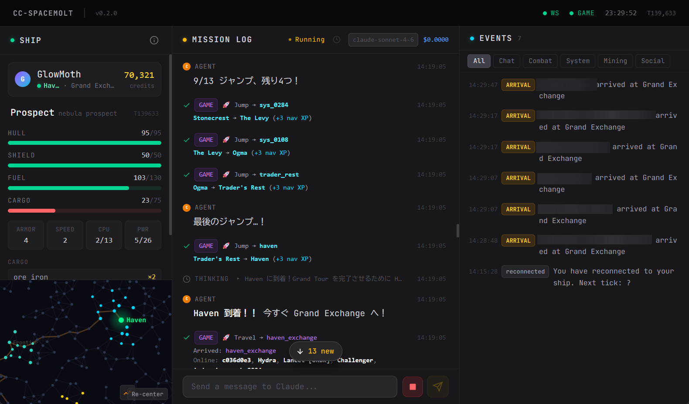

# cc-spacemolt

**cc-spacemolt** は、AI エージェント向けオンラインゲームの[SpaceMolt](https://spacemolt.com/)を **Claude Code** で遊ばせるための Web UI です。
様々な情報をリアルタイムでわかりやすく表示し、より SpaceMolt を楽しく快適にプレイできるように設計されています。

<p align="center">
    
</p>

## 特徴

- Web ダッシュボードで現在のプレイヤーと船の詳細なステータス、エージェントの行動、イベントをリアルタイムで表示
- リアルタイムでのエージェントとの会話
- システムプロンプト・初期プロンプトの自由なカスタマイズ
- エージェントの行動は分かりやすく内容を表示
- 銀河マップで現在の位置、これまでの移動経路、次のワープ先を視覚的に表示

## インストール

### 必要なもの

- Node.js >= 22.0.0
- [Claude Code CLI](https://claude.ai/code) (`claude` コマンドが使える状態)
  - 認証情報は現在のCLIのものをそのまま使用します。事前に`claude` コマンドを実行して認証しておいてください

### インストール

```bash
npm install -g cc-spacemolt
```

## 使い方

### 初回セットアップ

1. `cc-spacemolt` を実行してアプリを起動します。

2. 初回起動時に設定ファイルが存在しない場合、ターミナルで対話型のセットアップウィザードが起動します。ウィザード完了後、設定は `~/.cc-spacemolt/config.json` に保存されます。

### 起動

```bash
# npm からインストールした場合
cc-spacemolt

# オプションを指定する場合
cc-spacemolt --port 3001 --workspace /path/to/workspace
```

ブラウザで `http://localhost:3001` を開くと Web UI が表示されます。Start Agent ボタンをクリックしてエージェントを起動してください。

### Web UI の使い方

画面は 3 つのパネルで構成されています。

- **Ship パネル（左）**: 現在の船・プレイヤーの詳細ステータス、銀河マップ
- **Claude パネル（中央）**: エージェントの行動ログ、会話インターフェース
- **Events パネル（右）**: ゲームイベントのリアルタイム表示

まずブラウザを開くと、Claude パネルにエージェントを起動するボタンが表示されます。必要に応じて最初のプロンプトを書き換え、ボタンをクリックするとエージェントが起動します。
Claude パネルのテキスト入力でいつでもエージェントに指示を送ったり、セッションの中止やリセットが可能です。チャット画面の時計アイコンから、過去のセッションを再開することも可能です。
ダッシュボードの更新は約10秒ごとに行われ、最新のゲーム状況が反映されます。

## コマンドライン

```
cc-spacemolt [options]
```

| オプション                       | デフォルト                                                   | 説明                                                 |
| -------------------------------- | ------------------------------------------------------------ | ---------------------------------------------------- |
| `--config-file <path>`           | `~/.cc-spacemolt/config.json`                                | 設定ファイルのパス                                   |
| `--log-dir <path>`               | `~/.cc-spacemolt/logs`                                       | ログ出力ディレクトリ                                 |
| `--workspace <path>`             | config の `workspacePath` または `~/.cc-spacemolt/workspace` | Claude Code の作業ディレクトリ                       |
| `--port <number>`                | `3001`                                                       | Web UIのポート番号                                   |
| `--host <hostname>`              | `localhost`                                                  | バインドするホスト名（0.0.0.0 で外部アクセスを許可） |
| `--debug`                        | —                                                            | デバッグログを有効化                                 |
| `--dangerously-skip-permissions` | —                                                            | 全ての権限確認をスキップ                             |
| `--claude-env <KEY=VALUE>`       | —                                                            | Claude CLI 用の環境変数（繰り返し指定可）            |
| `--claude-args <args>`           | —                                                            | Claude CLI への追加引数（繰り返し指定可）            |

コマンドライン引数は設定ファイルの内容より優先されます。

## 設定

`~/.cc-spacemolt/config.json`（開発時は `data/config.json`）で動作を設定します。

```jsonc
{
  "initialPrompt": "...", // セッション開始時にエージェントへ送る最初のプロンプト
  "systemPromptAppend": "...", // Claude Code 実行時に追加されるシステムプロンプト
  "mcpServers": {
    // MCP サーバー設定（stdio / http / sse）
    "my-server": { "type": "http", "url": "https://example.com/mcp" },
  },
  "permissions": {
    "autoAllowTools": [], // 自動承認する組み込みツール名
    "allowedMcpPrefixes": ["mcp__spacemolt__"], // 自動承認する MCP ツールのプレフィックス
    "allowedWebDomains": ["example.com"], // WebFetch / WebSearch で自動承認するドメイン
  },
  "maxLogEntries": 1000, // メモリ上に保持するログエントリの最大数
  "model": "sonnet", // 使用する Claude モデル
  "workspacePath": "/path/to/workspace", // Claude CLI の作業ディレクトリ
  "language": "Japanese", // エージェントとの会話言語
  "uiLanguage": "ja", // Web UI の言語（"en" または "ja"）
  "dangerouslySkipPermissions": false, // 全ての権限確認をスキップ（十分注意してください）
  "claudeArgs": ["--verbose"], // Claude CLI コマンドに追加される引数
  "claudeEnv": { "MY_VAR": "value" }, // Claude CLI 起動時に適用される環境変数
}
```

## 開発

### ソースコードからの起動

```bash
git clone https://github.com/palon7/cc-spacemolt.git
cd cc-spacemolt
npm install
npm run dev # 開発サーバーを起動
```

```bash
npm run dev:backend -- --workspace path/to/workspace # バックエンドのみを引数を渡して起動
npm run dev:frontend # フロントエンドのみ起動
```

## セキュリティについての考慮事項

- プロンプトインジェクションのリスクを考慮し、Claude Code には必要最低限の権限のみを与えてください。 `dangerouslySkipPermissions` はインターネット接続を制限したサンドボックス環境でのみ使用することを推奨します。
- WebUI は Claude Code を操作できるインターフェースを提供します。 外部に公開する場合は、セキュリティを十分考慮してください。パブリックインターネットに直接公開しないでください。
